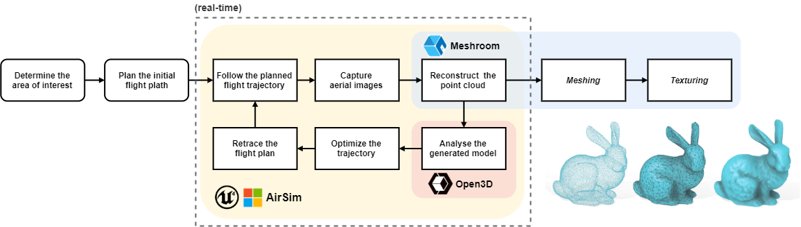

# ff



## Directory structure
```bash
.
├── docs                    # Project proposal and reports
│
├── misc                    # General scripts for setup and workflow automation
│
├── reconstruction
│   ├── models              # Reconstructed models/scenes
│   │   ├── <model name>
│   │   │   ├── data        # Reconstruction files (.ply, .sfm, .log, etc.)
│   │   │   ├── images      # Used images files (.jpg)
│   │   │   └── Meshroom    # Meshroom intermediate files
│   │   └── ...
│   └── tanksandtemples     # Tanks and Temples benchmark evaluation scripts
│
├── simulation
│   ├── ff                  # Code common to drone scripts and AirSim wrapper
│   ├── multirotor          # AirSim related code for drone control
│   └── viewpoints          # Images captured in the simulator
│
└── visualization           # Open3D related code
```